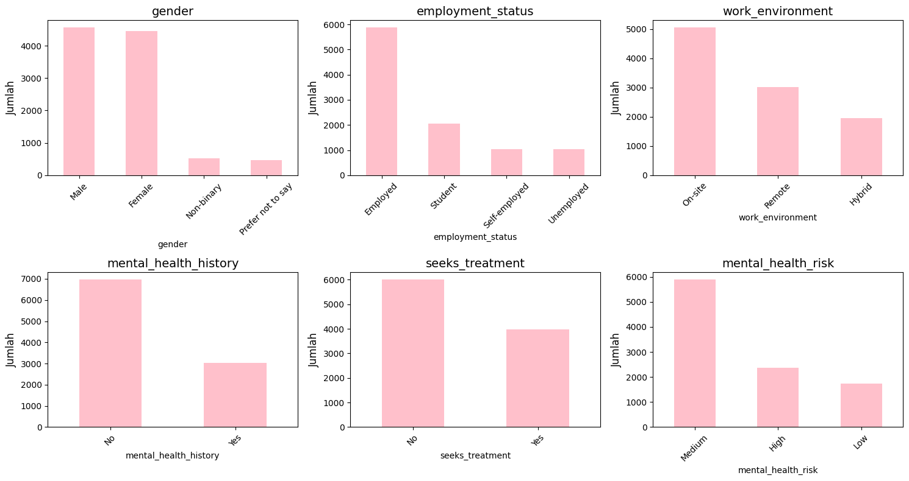
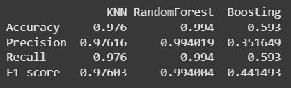

# Laporan Proyek Pertama Kelas Machine Learning Terapan - Dwi Laras Setyadita
---
## Domain Proyek
Proyek Machine Learning ini mengangkat domain kesehatan. Proyek yang dibangun adalah 
*Prediksi Resiko Penyakit Mental* yang dibangun dengan data. .

## Latar Belakang
Masalah kesehatan mental dan regulasi emosi menjadi isu yang semakin memerlukan perhatian serius di berbagai kelompok 
usia. Berdasarkan Survei Kesehatan Indonesia 2023 yang dilakukan oleh Kementerian Kesehatan, prevalensi depresi 
nasional mencapai 1,4%, yang menunjukkan bahwa gangguan kesehatan mental bukanlah hal yang jarang terjadi[1]. Selain 
itu, survei dari Indonesia National Adolescent Mental Health 2022 mengungkap bahwa satu dari tiga individu mengalami 
masalah kesehatan mental, sementara satu dari dua puluh mengalami gangguan mental dalam 12 bulan terakhir[2]. Temuan 
ini mencerminkan bahwa permasalahan kesehatan mental bersifat lintas usia dan perlu penanganan menyeluruh yang 
melibatkan berbagai pendekatan, termasuk edukasi, dukungan sosial, serta inovasi teknologi dalam bidang kesehatan 
mental.
 
 
Pemanfaatan teknologi digital, khususnya sistem pendukung berbasis kecerdasan buatan, berpotensi menjadi solusi 
inovatif untuk meningkatkan kesadaran serta deteksi dini risiko masalah kesehatan mental. Dengan kemampuan 
analisis data yang cepat dan akurat, teknologi ini dapat membantu mengidentifikasi pola perilaku dan gejala 
yang mengarah pada resiko penyakit mental. Selain itu, penggunaan aplikasi dan platform digital juga memungkinkan 
akses layanan kesehatan mental yang lebih luas dan mudah dijangkau oleh berbagai kelompok masyarakat, 
sehingga intervensi dapat dilakukan lebih cepat dan tepat sasaran.

## Business Understanding

## Problem Statements
Berdasarkan latar belakang yang telah disampaikan, terdapat beberapa rumusan masalah yang akan diselesaikan pada proyek ini : 
1. Faktor apa saja yang memengaruhi tingkat resiko penyakit mental pada individu.
2. Bagaimana cara membangun model machine learning untuk melakukan klasifikasi tingkat resiko penyakit mental?
3. Bagaimana cara memilih model machine learning dengan akurasi, precision, recall, dan F1-score terbaik untuk masalah prediksi resiko penyakit mental?

### Goals
Proyek ini dibangun dengan tujuan:
1. mengetahui variabel dan fitur yang berpengaruh terhadap tingkat resiko kesehatan mental individu.
2. mengetahui cara membangun model machine learning untuk melakukan klasifikasi tingkat kesehatan mental individu 
berdasarkan data.
3. Mengevaluasi dan membandingkan model berdasarkan akurasi, precision, recall, dan F1-score terbaik, untuk menentukan model yang 
paling optimal.

### Solution Statements
Dalam upaya mendapatkan model machine learnig yang paling baik untuk memprediksi tingkat resiko penyakit mental, saya 
membuat 3 model klasifikasi berbeda untuk dibandingkan, yaitu : 
1. KNN (K-Nearest Neighbor) adalah model machine learning yang bekerja dengan cara membandingkan jarak dari suatu sampel 
ke sampel pelatihan yang lain dengan memilih sejumlah (k) tetangga terdekat.
2. Random Forest adalah algoritma machine learning yang digunakan untuk menyelesaikan mesalah klasifikasi dan regresi, 
random forest adalah kumpulan dari beberapa model decision tree yang mesing-masing memiliki hyperparameter berbeda dan 
dilatih pada beberapa bagian data yang berbeda. Dengan melakukan beberapa keputusan sekaligus dengan beberapa pohon,
algoritma random fores sangat cocok untuk digunakan pada kasus klasifikasi. 
3. Boosting adalah metode klasifikasi yang menggabungkan banyak model sederhana secara bertahap untuk meningkatkan 
akurasi dengan fokus memperbaiki kesalahan prediksi sebelumnya.

## Data Understanding
Dataset yang digunakan pada proyek ini diambil dari 
 
https://www.kaggle.com/datasets/mahdimashayekhi/mental-health
 
### EDA - Deskripsi Variabel
Dataset yang digunakan terdiri dari 10.000 rows data dan 14 columns:
- **age**: Usia responden dalam tahun.
- **gender**: Jenis kelamin responden (Male, Female, Non-binary, dan prefer to not say).
- **employment_status**: Status pekerjaan responden (employed, student, self-employed, dan unemployed).
- **work_environment**: Kondisi lingkungan kerja responden (onsite, online, dan hybrid).
- **mental_health_history**: Riwayat kesehatan mental sebelumnya (Yes/No).
- **seeks_treatment**: Apakah responden pernah mencari perawatan kesehatan mental (Yes/No) .
- **stress_level**: Tingkat stres yang dialami responden,range 1-10.
- **sleep_hours**: Jumlah jam tidur rata-rata per hari, range 1-10.
- **physical_activity_days**: Jumlah hari dalam seminggu dengan aktivitas fisik, range 1-7.
- **depression_score**: Skor tingkat depresi responden, range 1-30.
- **anxiety_score**: Skor tingkat kecemasan responden, range 1-21.
- **social_support_score**: Skor tingkat dukungan sosial yang diterima responden, range 1-100.
- **productivity_score**: Skor tingkat produktivitas responden, range 1-100.
- **mental_health_risk**: Kategori risiko kesehatan mental yang dihasilkan dari analisis data (high, low, medium).

### Variable - variable pada dataset
- Data Integer =  age, stress_level, physical_activity_days, depression_score, anxiety_score, social_support_score.
- Data Float = sleep_hours, productivity_score
- Data Object = gender, employment_status, work_environment, mental_health_history, seeks_treatment, mental_health_risk
### Missing Value, Data Duplikat dan Outlier
- tidak ditemukan missing value di dalam dataset
- tidak ditemukan outlier di dalam dataset
- tidak ditemukan data duplikat di dalam dataset
### EDA - Univariate Analysis
Analisis univariat dilakukan untuk memahami distribusi masing-masing variabel secara individual. Beberapa temuan awal:

##### Kolom Categorical 

- Terdapat 4 kategori dalam fitur gender yang didominasi dengan kategori Male dan Female dengan perbandingan yang cukup seimbang. 
- Terdapat 4 kategori dalam fitur employment, secara berurutan dari yang paling banyak adalah employed, kemudian diikuti student, self emoployed, dan yang paling sedikit adalah unemployed.
- Terdapat 3 kategori dalam fitur work_environtment. secara berurutan dari yang paling banyak adalah onsite, Remote, dan Hybrid.
- Terdapat 2 kategori dalam fitur mental_health_history. dengan hampir 70% data memiliki value no yang berarti sebagian besar tidak memiliki riwayat penyakit mental.
- Terdapat 2 kategori dalam fitur seeks_treatment, yaitu yes dan no. dengan hampir 60% data menyatakan no yang artinya belum pernah mencari bantuan professional dalam masalah kesehatan mental.
- Terdapat 3 kategori dalam fitur mental_health_risk. Secara berurutan dari yang terbesar adalah medium sebesar 58,9% high sebesar 23,7%, dan low sebesar 17,4%.

##### Kolom Numerik

- Data pada kolom stress_level, age, physical_activity_days, anxiety_score, dan social_support_score cenderung memiliki presebaran yang merata.
- Terdapat peningkatan jumlah yang signifikan pada data fitur depression_rate dengan score 30.
- Terdapat peningkatan jumlah yang signifikan pada data fitur productivity_score pada nilai maksimal (100).
- Data sleep_hours cenderung terdistribusi normal.

### EDA - Multivariate Analysis

##### Kolom Categorical

- Pada fitur gender, resiko kesehatan mental cenderung merata di semua gender dengan mayoritas berada pada resiko sedang, 
tidak ada kategori tertentu yang cenderung memiliki resiko kesehatan mental high, medium, maupun low.
- Pada fitur employment status, resiko kesehatan mental pada setiap kategori cenderung merata, tidak ada kategori 
tertentu yang cenderung memiliki resiko kesehatan mental high, medium, maupun low.
- Pada fitur employment_environtment, resiko kesehatan mental pada setiap kategori juga cenderung merata, tidak ada 
kategori tertentu yang cenderung memiliki resiko kesehatan mental high, medium, maupun low.
- Pada fitur mental_health_history, resiko kesehatan mental pada setiap kategori cenderung merata, tidak ada kategori 
tertentu yang cenderung memiliki resiko kesehatan mental high, medium, maupun low.
- Pada fitur seeks_treatment, tidak ada kategori tertentu yang cenderung memiliki resiko kesehatan mental high, medium, 
maupun low.
 
 
- Fitur seeks_treatment menunjukkan hubungan yang signifikan secara statistik terhadap fitur mental_health_risk. Hal 
ini dapat diartikan bahwa kecenderungan individu untuk mencari bantuan atau perawatan memiliki pengaruh yang signifikan 
terhadap tingkat resiko kesehatan mental mereka.
- Fitur lain seperti gender, employment_status, work_environtment, dan mental_health_history tidak menunjukkan hubungan 
statistik yang signifikan terhadap fitur mental_health_risk. Hal ini dapat diartikan bahwa faktor-faktor tersebut tidak 
cukup kuat untuk membedakan tingkat resiko kesehatan mental pada individu.

##### Kolom Numerik

- Pada fitur age, tidak terdapat kalangan umur tertentu yang memiliki kecenderungan resiko kesehatan mental kategori high, 
medium, maupun low.
- Pada fitur stress_level, variasi stress pada setiap individu di dalam kategori mental_health_risk cenderung mirip, 
namun tingkat stress secara umum (berdasarkan median) pada fitur mental_health_risk kategori low cenderung memiliki 
tingkat stress yang lebih rendah.
- Pada fitur sleep_hours, tidak terdapat waktu tidur tertentu yang memiliki kecenderungan kesehatan mental kategori 
high, medium, maupun low.
- Pada fitur physical_activity_days, individu dengan resiko kesehatan mental kategori high menunjukkan kecenderungan 
memiliki tingkat akivitas fisik yang lebih tinggi dibandingkan kategori lainnya. Individu dengan resiko kesehatan mental
high dan low memiliki median aktivitas fisik mingguan yang sama, yaitu sekitar 4 hari. Sementara itu, individu dengan 
resiko kategori Medium memiliki median aktivitas fisik yang lebih rendah yaitu sekitar 3 hari.
- Pada fitur depression_score, menunjukkan bahwa semakin tinggi resiko kesehatan mental seseorang, semakin tinggi pula 
skor depresi yang dimilikinya. ini menunjukkan bahwa kolom depression_score menunjukkan korelasi yang tinggi dengan 
kolom mental_health_risk.
- Pada fitur anxiety_score, menunjukkan bahwa semakin tinggi resiko kesehatan mental seseorang, semakin tinggi pula 
anxiety_score yang dimilikinya. ini menunjukkan bahwa kolom anxiety_score memiliki korelasi yang cukup tinggi dengan 
kolom mental_health_risk.
- Distribusi nilai pada fitur social_support terlihat relatif merata di setiap kategori mental_health_risk, tanpa adanya 
perbedaan yang mencolok di antara kategori tersebut.
- Pada fitur productivity_score menunjukkan korelasi yang kuat dengan fitur mental_health_risk. Dimana resiko kesehatan
mental individu dengan kategori low memiliki tingkat produktifitas tertinggi dengan nilai median sekitar 95, kemudian 
individu dengan resiko kesehatan mental kategori medium memiliki nilai median tingkat produktifitas yang lebih rendah 
yaitu sekitar 80, dan yang terakihr adalah individu dengan tingkat resiko kesehatan mental kategori hight memiliki 
tingkat produktivitas terendan dengan median sekitar 60-an.

## Data Preparation
- Menghapus kolom yang tidak relevan. Beberapa kolom tersebut adalah 'gender', 'employment_status', 'work_environment', 'mental_health_history', 'age', 'stress_level', 'sleep_hours', dan 'social_support_score' dihapus karena tidak memiliki pengaruh yang signifikan terhadap tingkat resiko kesehatan mental (variabel target).
- Melakukan Label Encoding untuk seeks_treatment (data kategorikal non ordinal dengan 2 label memungkinkan untuk dilakukan label encoding) dan mental_health_risk adalah data ordinal sehingga encoder dilakukan dengan metode labeling.
- Melakukan spliting pada dataset dengan rasio pembagian 90% untuk data training dan 10% untuk data testing. Berdasarkan data yang berjumlah 10.000, rasio ini sudaha baik karena model memiliki cukup data untuk training dan cukup data untuk melakukan testing.
- Melakukan Scalling dengan StandardScaller untuk membuat data numerik berada pada rentang nilai yang sama. Hal ini dilakukan agar algoritma tidak bias, kecenderungan model seperti KNN menganggap kolom dengan rentang nilai yang tinggi adalah kolom yang penting. 

## Modeling
- Model K-Nearest Neighbors (KNN) digunakan untuk mengklasifikasikan risiko kesehatan mental dengan parameter 
n_neighbors=10, yang berarti setiap prediksi didasarkan pada 10 tetangga terdekat dalam data latih. KNN adalah 
algoritma yang sederhana dan mudah dipahami, namun memiliki kelemahan seperti kurang efektif pada data berdimensi 
tinggi (curse of dimensionality), sensitif terhadap outlier, dan performa yang menurun jika data tidak seimbang. 
Selain itu, waktu prediksi bisa menjadi lambat pada dataset besar karena perlu menghitung jarak ke seluruh data latih.

- Random Forest merupakan metode ensemble yang menggabungkan hasil dari banyak pohon keputusan untuk meningkatkan 
akurasi dan mengurangi risiko overfitting. Model ini menggunakan n_estimators=50, artinya 50 pohon dibangun, serta 
max_depth=16 yang membatasi kedalaman maksimal tiap pohon untuk mengontrol kompleksitas model. Parameter 
random_state=55 digunakan agar hasil pelatihan konsisten dan dapat direproduksi. Sementara itu, n_jobs=-1 memungkinkan 
model memanfaatkan seluruh inti CPU yang tersedia untuk mempercepat proses pelatihan. Random Forest sangat kuat dalam 
menangani data kompleks dan tahan terhadap noise, tetapi model ini sulit diinterpretasikan dan membutuhkan sumber daya 
komputasi yang lebih besar.

- AdaBoostClassifier digunakan sebagai metode boosting, dengan learning_rate=0.05, yang menentukan seberapa besar 
kontribusi setiap model lemah dalam pembelajaran bertahap. Model ini juga menggunakan random_state=55 untuk memastikan 
hasil yang konsisten. Boosting bekerja dengan memperbaiki kesalahan model sebelumnya secara iteratif, sehingga 
meningkatkan performa keseluruhan. Namun, AdaBoost dapat menjadi sensitif terhadap outlier dan noise, serta memiliki 
waktu pelatihan yang lebih lambat dibandingkan beberapa metode lain karena proses pembelajarannya yang bertahap.

## Evaluasi

Evaluasi model dilakukan menggunakan metric accuracy, precision, Recall, dan F1-score untuk mengukur performa dari 
masing-masing model yang digunakan yaitu KNN, Random Forest, dan Boosting Algorithm. 
Berdasarkan hasil akurasi didapatkan informasi sebagai berikut:
- KNN menjadi model dengan akurasi tertinggi sebesar 60,2% diikuti oleh Boosting sebesar 59,3% sementara Random forest 
hanya memperoleh akurasi sebesar 23,8%.
- KNN dan Boosting mencapai recall yang relatif sama dengan akurasi yaitu 60,2% dan 59,3%.
- Precision model KNN sebesar 52,98% menunjukkan bahwa, secara rata-rata, sekitar 52,98% dari prediksi yang dibuat oleh 
model KNN untuk masing-masing kelas (high, medium, dan low) adalah benar. Ini berarti lebih dari separuh prediksi yang 
diberikan model sesuai dengan label aslinya, meskipun masih terdapat ketidakseimbangan akurasi antar kelas.
- Namun, F1-score KNN (46,1%) lebih tinggi dibandingkan Boosting (44,1%), menunjukkan keseimbangan yang sedikit lebih 
baik antara Precision dan Recall.
- Random Forest menunjukkan performa terburuk di semua metrik, terutama F1-score hanya 10%, yang menandakan 
ketidakseimbangan prediksi dan kegagalan menangkap pola yang relevan.

### Penyelesaian permasalahan
1. Setelah melakukan proses EDA, berhasil dilakukan identifikasi fitur-fitur penting dalam klasifikasi resiko kesehatan 
mental yaitu: seeks_treatment, physical_activity_days,	depression_score,	anxiety_score, dan	productivity_score
2. Didalam proyek ini telah dibangun  3 algoritma klasifikasi untuk melakukan prediksi klasifikasi resiko kesehatan mental.
3 model yang dibangun adalah : KNN, Random Forest, dan Boosting Algorithm. Penggunaan parameter seperti n_neighbors, 
n_estimators, dan learning_rate juga sudah dioptimalkan sesuai kebutuhan.
3. Dari evaluasi yang dilakukan, KNN terbukti sebagai model paling optimal, karena memiliki nilai tertinggi untuk semua 
metrik dibandingkan model lain. Meskipun Boosting mencapai metrix yang hampir sama dengan KNN, F1-score dan Precision-nya 
masih berada di bawah KNN. Random Forest, meskipun kuat dalam banyak kasus, tidak cocok untuk dataset ini, terbukti dari 
performanya yang buruk.

### Kesimpulan 
Berdasarkan hasil evaluasi, model KNN adalah model terbaik yang dapat dijadikan model untama untuk prediksi klasifikasi 
resiko kesehatan mental dalam konteks ini. Meskipun model KNN yang didapatkan belum mencapai metrik yang sempurna, model 
ini cukup andal dalam mengenali pola resiko data yang digunakan.

Dengan tujuan yang telah dicapat, diharapkan proyek ini dapat memberikan predeiksi resiko kesehatan mental lebih dini
dan dapat meningkatkan kesadaran pengguna untuk segera mencari pertolongan apabila terdapat indikasi resiko kesehatan metal yang dialami. 

## Referensi

[1] Kementerian Kesehatan Republik Indonesia, *Laporan Tematik Survei Kesehatan Indonesia Tahun 2023: Potret Indonesia Sehat*, Jakarta: Kementerian Kesehatan RI, 2024. Diterbitkan oleh Kementerian Kesehatan RI dan dikeluarkan oleh Badan Kebijakan Pembangunan Kesehatan. [Online]. Available: https://drive.google.com/file/d/1AnuDQgQufa5JSXEJWpBSv4r7v6d5YZm7/view. [Accessed: May 24, 2025].

[2] Universitas Gadjah Mada, Universitas Sumatera Utara, Universitas Hasanuddin, The University of 
Queensland Australia, Johns Hopkins Bloomberg School of Public Health, and Kementerian Kesehatan Republik 
Indonesia, *I-NAMHS: Indonesia-National Adolescent Mental Health Survey*, 2022.
